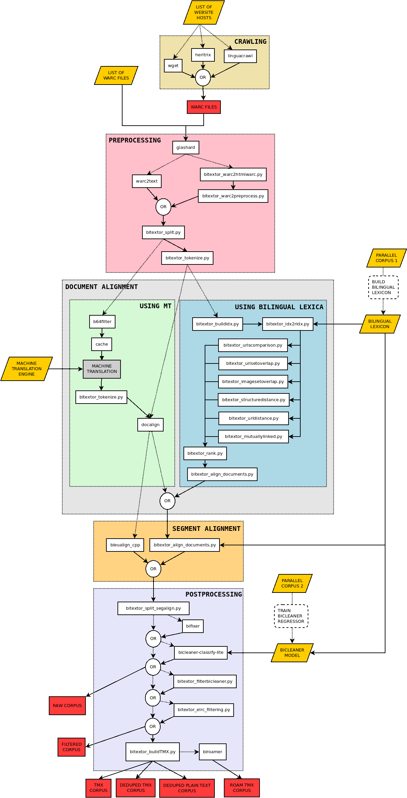

# 


[](https://discord.gg/etYDaZm)
[](https://snakemake.readthedocs.io)

`Bitextor` is a tool to automatically harvest bitexts from multilingual websites. To run it, it is necessary to provide:

1. The source where the parallel data will be searched: one or more websites (namely, Bitextor needs [website hostnames](https://en.wikipedia.org/wiki/URL) or [WARC files](https://iipc.github.io/warc-specifications/specifications/warc-format/warc-1.1/))
2. The two languages on which the user is interested: language IDs must be provided following the [ISO 639-1](https://en.wikipedia.org/wiki/List_of_ISO_639-1_codes)
3. A source of bilingual information between these two languages: either a bilingual lexicon (such as those available at the [bitextor-data repository](https://github.com/bitextor/bitextor-data/releases/tag/bitextor-v1.0)), a machine translation (MT) system, or a parallel corpus to be used to produce either a lexicon or an MT system (depending on the alignment strategy chosen, see below)

## Installation

Bitextor can be installed built from source. See [INSTALL.md](INSTALL.md) for instructions.

## Usage

```text
usage: bitextor [-C FILE [FILE ...]] [-c KEY=VALUE [KEY=VALUE ...]]
                [-j JOBS] [-k] [--notemp] [--dry-run]
                [--forceall] [--forcerun [TARGET [TARGET ...]]]
                [-q] [-h]

launch Bitextor

Bitextor config::
  -C FILE [FILE ...], --configfile FILE [FILE ...]
                        Bitextor YAML configuration file
  -c KEY=VALUE [KEY=VALUE ...], --config KEY=VALUE [KEY=VALUE ...]
                        Set or overwrite values for Bitextor config

Optional arguments::
  -j JOBS, --jobs JOBS  Number of provided cores
  -k, --keep-going      Go on with independent jobs if a job fails
  --notemp              Disable deletion of intermediate files marked as temporary
  --dry-run             Do not execute anything and display what would be done
  --forceall            Force rerun every job
  --forcerun TARGET [TARGET ...]
                        List of files and rules that shall be re-created/re-executed
  -q, --quiet           Do not print job information
  -h, --help            Show this help message and exit
```

## Advanced usage

Bitextor uses [Snakemake](https://snakemake.readthedocs.io/en/stable/index.html) to define Bitextor's workflow and manage its execution. Snakemake provides a lot of flexibility in terms of configuring the execution of the pipeline. For advanced users that want to make the most out of this tool, `bitextor-full` command is provided that calls Snakemake CLI with Bitextor's workflow and exposes all of Snakemake's parameters.

### Execution on a cluster

To run Bitextor on a cluster with a software that allows to manage job queues, it is recommended to use `bitextor-full` command and use [Snakemake's cluster configuration](https://snakemake.readthedocs.io/en/stable/executing/cli.html#profiles).

## Bitextor configuration file

Bitextor uses a configuration file to define the variables required by the pipeline. Depending on the options defined in this configuration file the pipeline can behave differently, running alternative tools and functionalities. The following is an exhaustive overview of all the options that can be set in the configuration file and how they affect to the pipeline.

**Suggestion**: A minimalist [configuration file sample](config/basic.yaml) is provided in this repository. You can take it as an starting point by changing all the paths to match your environment.

Current pipeline constists of the following steps:

* Crawling
* Preprocessing
* Sharding
* Sentence splitting
* Translation
* Tokenisation (source and translated target)
* Document alignment
* Segment alignment
* Cleaning and filtering

Following is a description of configuration related to each step, as well as basic variables.

### Basic variables

There are a few variables that are mandatory for running Bitextor, independently of the task to be carried out:

```yaml
permanentDir: /home/user/permanent/bitextor-output
dataDir: /home/user/permanent/data
transientDir: /home/user/transient
tempDir: /home/user/transient

profiling: true
```

* `permanentDir`, `transientDir`, `tempDir` and `dataDir` are the folders used during processing. `permanentDir` will contain the final results of the run, i.e. the parallel corpus built; `dataDir` will contain the results of crawling (WARC files) and files generated during preprocessing;`transientDir` will contain the result of every step of the pipeline, and `tempDir` will contain temporary files that are needed by some steps and removed immediately after they are no longer required.
* `profiling`: use `/usr/bin/time` tool to obtain profiling information about each step.

### Workflow execution

There are some optional parameters that allow for a finer control of the execution of the pipeline, namely it is possible to configure some jobs to use more than one core; and it is possible to have a partial execution of Bitextor by specifying what step should be final.

```yaml
until: preprocess
parallelWorkers: {translate: 4, docaling: 8, segaling: 8, bicleaner: 2}
```

* `until`: pipeline executes until specified step and stops. The resulting files will not necessarily be in `permanentDir`, they can also be found in `dataDir` or `transientDir` depending on the rule. Allowed values are: {`crawl`, `preprocess`, `shard`, `split`, `translate`, `tokenise_src`, `tokenise_trg`, `docalign`, `segalign`, `bifixer`, `bicleaner`, `filter`}.
* `parallelWorkers`: a dictionary specifying the number of cores that should be used for a job. The jobs that can be executed in parallel in this way are: {`split`, `translate`, `tokenise_src`, `tokenise_trg`, `docalign`, `segalign`, `bifixer`, `bicleaner`, `sents`}.

### Data sources

The next set of options refer to the source from which data will be crawled. Three options can be specified for crawling: one is to specify a list of websites to be crawled in the config file, another one is defining a list of websites in a separated gzipped file, while the last one is to provide a *langstat* file (see below) containing language statistics regarding the documents in one or more websites, so promising websites can be identified.

```yaml
hosts: ["www.elisabethtea.com","vade-antea.fr"]
hostsFile: /home/user/hosts.gz

warcs: ["/home/user/a.warc.gz", "/home/user/b.warc.gz"]
warcsFile: /home/user/warcs.gz
```

* `hosts`: list of [hosts](https://en.wikipedia.org/wiki/URL) to be crawled; the host is the part of the URL of a website that identifies the web domain, this is, the URL without the protocol and the path. For example, in the case of the url *<https://github.com/bitextor/bitextor>* the host would be *github.com*
* `hostsFile`: a path to a file that contains a list of hosts to be crawled; in this file each line should contain a single host, written in the format described above.
* `warcs`: specify one or multiple [WARC](https://iipc.github.io/warc-specifications/specifications/warc-format/warc-1.1) files to use. This option allows to  a define a list of gz compressed WARC files (each record compressed individually), which will be used to extract parallel data.
* `warcsFile`: a path to a file that contains a list of WARC files to be included in parallel text mining (silimar to `hosts` and `hostsFile`)

### Crawling

```yaml
crawler: wget

crawlTimeLimit: 30s

crawlSizeLimit: 1G
crawlTLD: false
crawlerNumThreads: 1
crawlerConnectionTimeout: 10
```

* `crawler`: set which crawler is used (only `wget` is supported in this Bitextor variant)
* `crawlerUserAgent`: [user agent](https://developers.whatismybrowser.com/useragents/explore/software_type_specific/crawler/) to be added to the header of the crawler when doing requests to a web server (identifies your crawler when downloading a website)
* `crawlTimeLimit`: time (in seconds) for which a website can be crawled; for example: *3600s* for a crawl of an hour (`linguacrawl` needs only the quantity, without any suffix)
* `crawlWait`: option that specifies the time that should be waited between the retrievals. It is intended to avoid a web-site to cut the connection of the crawler due too many connections in a low interval of time
* `crawlFileTypes`: allows to specify the files which we want to retrieve. Both `wget` and `linguacrawl` use the Content-Type in order to search a pattern which matches, so either "html" or "text/html" will retrieve those files with Content-Type "text/html". The [Content-Type header](https://developer.mozilla.org/en-US/docs/Web/HTTP/Headers/Content-Type) contains [MIME](https://developer.mozilla.org/en-US/docs/Web/HTTP/Basics_of_HTTP/MIME_types) values

If you want to also crawl PDFs (only `wget` support for now), use these settings:

```yaml
crawler: wget
crawlFileTypes: "html,pdf"
```

### Preprocessing and sharding

After crawling, the downloaded web are processed to extract clean text, detect language, etc. The following set of option define how that process is carried out. After preprocessing, the extracted data is sharded via [giashard](https://github.com/paracrawl/giashard).

```yaml
# preprocessing
langs: [en, es, fr]

## with warc2preprocess only
boilerpipeCleaning: true
ftfy: false
cleanHTML: false

# sharding
shards: 8 # 2^8 shards
batches: 1024 # batches of up to 1024MB
```

* `langs`: a list of languages that will be processed during the preprocessing step. When this option is empty, only LANG1 and LANG2 will be processed during this step. NOTE: if `warc2text`is enabled, every language will be processed, but only languages specified in `langs` will move on to sentence splitting
* `ftfy`: ftfy is a tool that solves encoding errors. Disabled by default
* `cleanHTML`: cleaning HTML takes place before parsing, and the point of this step is to remove some parts of HTML that don't contain text (such as CSS, embedded scripts or special tags) before running ftfy, which is a quite slow. This has an unwanted side effect of removed too much content if the HTML document is malformed. So, enable this step if you want to gain time at the risk of losing some text
* `html5lib`: extra parse with `html5lib`, which is slow but the cleanest option and parses the HTML the same way as the modern browsers, which is interesting for broken HTMLs.
* `boilerpipeCleaning`: option that enables the use of the tool [boilerpipe](https://boilerpipe-web.appspot.com/) to remove boilerplates from HTML documents; by default this is disabled. NOTE: this option does not do anything with `warc2text: true`
* `PDFextract`: set to 'true' to use it instead of system native poppler `pdf2html` converter
* `PDFextract_configfile`: set a path for a PDFExtract config file, specially for language models for a better sentence splitting (see [more info](https://github.com/bitextor/pdf-extract/#pdfextractjson))
* `PDFextract_sentence_join_path`: set a path for sentence-join.py script, otherwise, the one included with bitextor will be used
* `PDFextract_kenlm_path`: set path for kenlm binaries
<!-- * `plainTextHashes`: file with plain text MurmurHashes from a previous Bitextor run, so only hashes that are not found in this file are processed in Bitextor. This is useful in case you want to fully recrawl a domain but only process updated content. Works with `bitextor-warc2preprocess` -->
* `shards`: domains and WARCs are distributed in shards for a more balanced processing, and all documents in a shard will be compared for document alignment. Each shard contain one or more complete domains/WARCs. The parameter sets the number os shards (as 'n' in 2^n), being 8 the default (2^8 shards). If you set it to zero with `shards: 0` it will be forcing all domains and WARCs provided to Bitextor to be compared for alignment.
* `batches`: shards are split into batches for parallelization. These batches can divide a domain or WARC, so this is only used in steps that can work with this division, like document aligner. This configuration parameter set the batch size in MB, being 1024 by default.

### Sentence splitting

By default a Python port of [Moses `split-sentences.perl`](https://pypi.org/project/sentence-splitter/) will be used for sentence splitting. This is recommened even without language support, since it is possible to provide custom non-breaking prefixes. External sentence splitter can by used via `sentence-splitters` parameter (less efficient).

```yaml
sentenceSplitters: {
  'fr': '/home/user/bitextor/preprocess/moses/ems/support/split-sentences.perl -q -b -l fr',
  'default': '/home/user/bitextor/bitextor/example/nltk-sent-tokeniser.py english'
}

customNBPs: {
  'fr': '/home/user/bitextor/myfrenchnbp.txt'
}
```

* `sentenceSplitters`: scripts for sentence splitting. All the scripts must read from the standard input and write to the standard output. When not specified, [python Moses](https://pypi.org/project/sentence-splitter) will be used.
* `customNBPs`: provide a set of files with custom Non-Breaking Prefixes for the default sentence-splitter. See their format by checking the [already existing files](https://github.com/berkmancenter/mediacloud-sentence-splitter/tree/develop/sentence_splitter/non_breaking_prefixes).

### Tokenisation

[Moses `tokenizer.perl`](https://github.com/moses-smt/mosesdecoder/blob/master/scripts/tokenizer/tokenizer.perl) is the default tokeniser, which is used through an efficient Python wrapper. This is the recommended option unless a language is not supported.

```yaml
wordTokenizers: {
  'fr': '/home/user/bitextor/mytokenizer -l fr',
  'default': '/home/user/bitextor/moses/tokenizer/my-modified-tokenizer.perl -q -b -a -l en'
}
morphologicalAnalysers: {
  'lang1': 'path/to/morph-analyser1',
  'lang2': 'path/to/morph-analyser2'
}
```

* `wordTokenizers`: scripts for word-tokenization. These scripts must read from the standard input and write to the standard output.
* `morphologicalAnalysers`: scripts for morphological analysis (lemmatizer/stemmer). It will only be applied to specified languages after tokenisation, or all of them if `default` script is also provided.

### Document alignment

From this step forward, bitextor works with a pair of languages, which are specified through `lang1` and `lang2` parameters. The output will contain the sentence pairs in that order.

```yaml
lang1: es
lang2: en
```

### Segment alignment

After document alignment, the next step in the pipeline is segment alignment.

### Parallel data filtering

Parallel data filtering is carried out with the tool [Bicleaner-AI](https://github.com/bitextor/bicleaner-ai).

### Post-processing

Some other options can be configured to specify the output format of our corpus:

```yaml
bifixer: true
elrc: true
tmx: true
deduped: false
deferred: false
```

* `bifixer`: if this option is set, [Bifixer](https://github.com/bitextor/bifixer) is used to fix parallel sentences and tag near-duplicates for removal. When using `bifixer: true`, it is possible to specify additional arguments using `bifixerOptions` variable. More information about these arguments in [Bifixer](https://github.com/bitextor/bifixer) repository.
* `elrc`: if this option is set, some ELRC quality indicators are added to the final corpus, such as the ratio of target length to source length; these indicators can be used later to filter-out some segment pairs manually
* `tmx`: if this option is set, the output corpus is formatted as a [TMX](https://en.wikipedia.org/wiki/Translation_Memory_eXchange) translation memory
* `deduped`: if this option is set in conjunction with `tmx`, the resulting TMX will not contain repeated segment pairs; if a segment pair is found in more than one pair of documents, it will be provided with more than two URLs, so it is possible to know in which original URLs it appeared
* `deferred`: if this option is set, segment contents (plain text or TMX) are deferred to the original location given a Murmurhash2 64bit checksum.

NOTE: In case you need to convert a TMX to a tab-separated plain-text file (Moses format), you could use [TMXT](https://github.com/sortiz/tmxt) tool

#### Biroamer

In order to ROAM the resulted TMX (either normal or deduped), you can use some options to configure the result:

```yaml
biroamer: true
biroamerOmitRandomSentences: true
biroamerMixFiles: ["/home/user/file-tp-mix1", "/home/user/file-to-mix2"]
biroamerImproveAlignmentCorpus: /home/user/Europarl.en-fr.txt
```

* `biroamer`: through this option we enable the ROAM feature. In order to ROAM the resulted TMX, [Biroamer](https://github.com/bitextor/biroamer) is used. If this option is set to 'true', `tmx: true` or `deduped: true` will be necessary.
* `biroamerOmitRandomSentences`: in order to omit random sentences, this option can be used. The quantity of sentences removed are close to 10% of the original TMX.
* `biroamerMixFiles`: when is necessary to add external sentences to improve anonymization, this option accepts a list of files which will add the stored sentences. The files are expected to be in morse format, and those files will be concatenated.
* `biroamerImproveAlignmentCorpus`: an alignment corpus can be provided in order to improve the entities detection. The corpus file is exteced to be in morse format.

## Pipeline description

Bitextor is a pipeline that runs a collection of scripts to produce a parallel corpus from a collection of multilingual websites. The pipeline is divided in five stages:

1. **Crawling**: documents are downloaded from the specified websites
2. **Pre-processing**: downloaded documents are normalized, boilerplates are removed, plain text is extracted, and language is identified
3. **Document alignment**: parallel documents are identified. Two strategies are implemented for this stage:
    * one using bilingual lexica and a collection of features extracted from HTML; a linear regressor combines these resources to produce a score in [0,1], and
    * another using machine translation and a [TF/IDF](https://en.wikipedia.org/wiki/Tf%E2%80%93idf) strategy to score document pairs
4. **Segment alignment**: each pair of documents is processed to identify parallel segments. Again, two strategies are implemented:
    * one using the tool [Hunalign](http://mokk.bme.hu/resources/hunalign/), and
    * another using [Bleualign](https://github.com/rsennrich/Bleualign), that can only be used if the MT-based-document-alignment strategy is used (machine translations are used for both methods)
5. **Post-processing**: final steps that allow to clean the parallel corpus obtained using the tool [Bicleaner](https://github.com/bitextor/bicleaner), deduplicates translation units, and computes additional quality metrics

The following diagram shows the structure of the pipeline and the different scripts that are used in each stage:




All documents and software contained in this repository reflect only the authors' view. The Innovation and Networks Executive Agency of the European Union is not responsible for any use that may be made of the information it contains.
